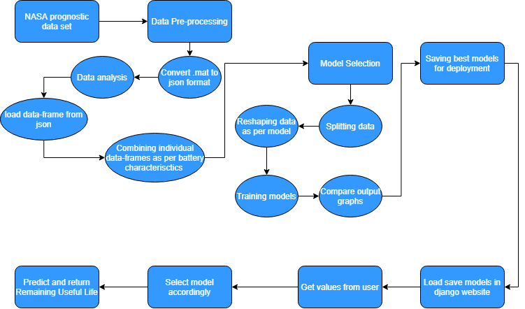
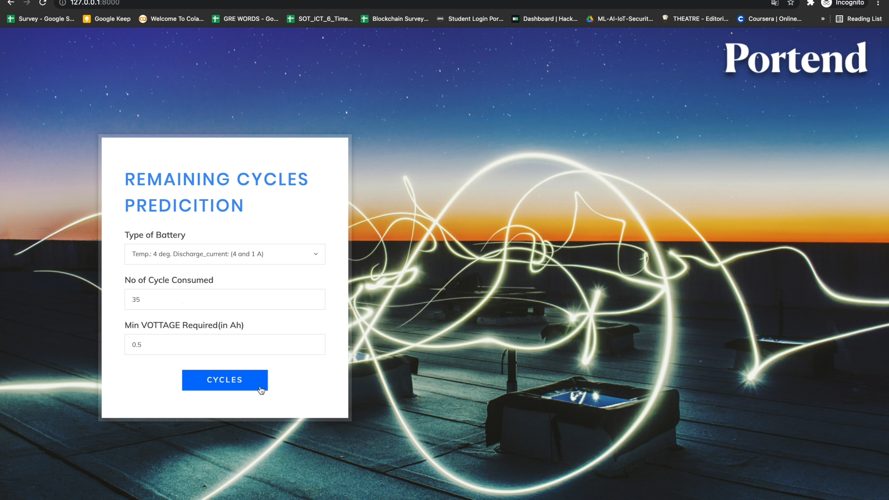
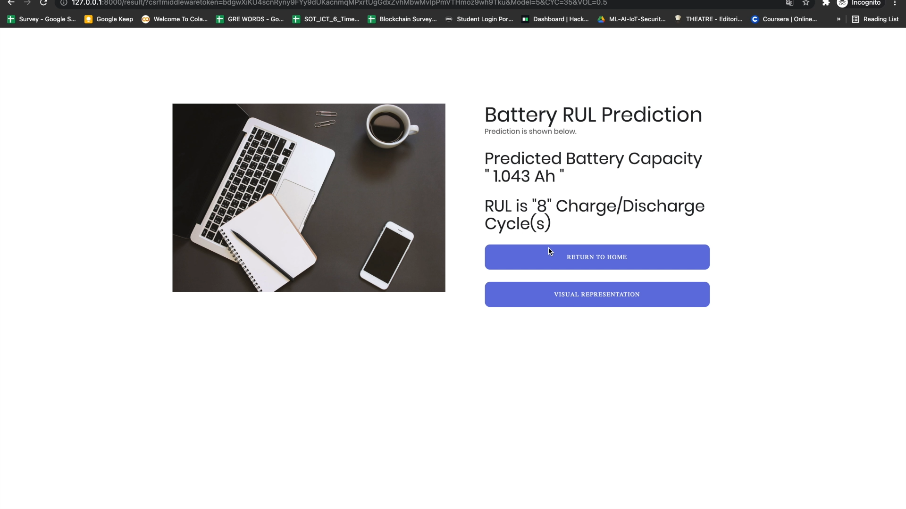
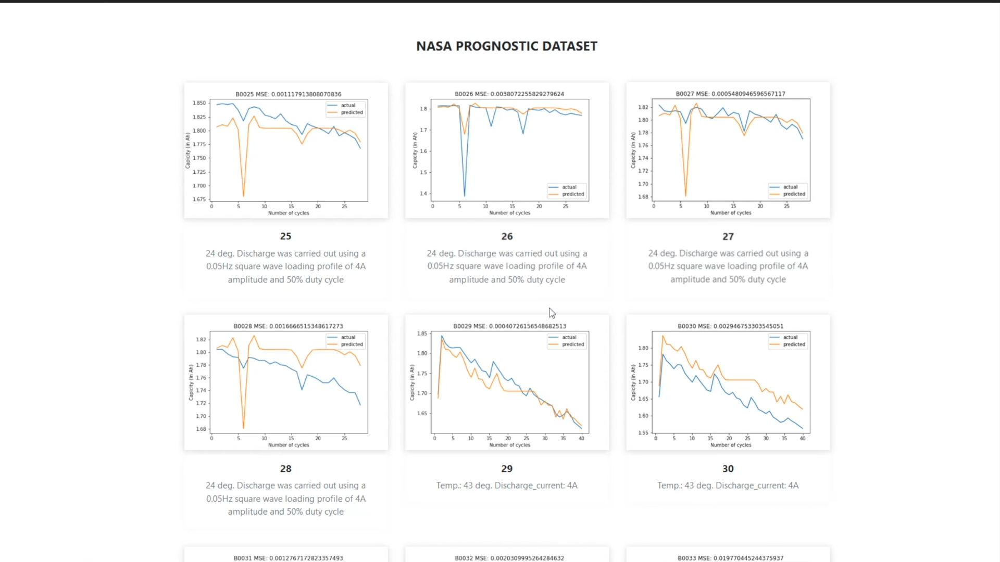

# Portend

## Let's Hack 4.0

We are team technophiles and participated in hackathon organized by PDEU and PDPU IIC. 

PS no.: 01

Problem Statement : Prediction of Remaining Useful Live of EV Batteries using AI and ML algorithm

Our college name: Pandit Deendayal Energy University(PDEU)

Team Members: Rushabh Thakkar, Divy Patel, Denish Kalariya, Yug Thakkar and Shubham Vyas

### **Problem Definition :**

> Most electric vehicles use lithium-ion batteries as energy storage system. As this battery technology shows degradation during service life, lifetime analyses are of interest to understand aging phenomena and to optimize batteries and their operation.

> Remaining Useful Life(RUL) of EV batteries is predicted so that we can replace these batteries before total breakdown and hence increasing the reliability of vehicle.

### **Our Approach / Solution :**

>> 

    
     Website:
              1. Load saved models in django website.
              2. Get values from users.
              3. Select model accordingly.
              4. Predict and return remaining useful life.  
  
## Home Page

>It first ask user to select battery type followed by the no. of cycle consumed (between 0 to 120) and at last the minimum voltage required

## Result

>It gives user the predicted battery capacity in Ah and also the Remaining Useful Life(RUL) cycles.

## Graph

>Visual Representation of NASA PROGNOSTIC DATASET

> **Presentation:** [T40](https://github.com/rushabh1605/Portend/blob/main/T40.pptx)

> **Profiles of team member:** 

- Rushabh Thakkar

[Linkedin](https://www.linkedin.com/in/rushabhthakkar/)
[Github](https://github.com/rushabh1605)
[Resume](https://drive.google.com/file/d/1MrEST2m7OiMRPsB-F7QaoezXCIzPOo8W/view?usp=sharing)

- Divy Patel

[Linkedin](www.linkedin.com/in/divy-patel-7b369118b)
[Github](https://github.com/Divy2000)
[Resume](https://drive.google.com/file/d/15co1lwJ51Ld9ydJyfPFAF2lXNLlU-3ZA/view?usp=sharing)

- Denish Kalariya

[Linkedin](https://www.linkedin.com/in/denish-kalariya-b22a641ba/)
[Github](https://github.com/Dk-21)
[Resume](https://drive.google.com/file/d/1gPyanEH-bpqPr0HxINCMX1v-Ufz2Jbm2/view?usp=sharing)

- Yug Thakkar

[Linkedin](https://www.linkedin.com/in/yug-thakkar-6a0021179/)
[Github](https://github.com/yugthakkar16)

- Shubham Vyas

[Linkedin](https://www.linkedin.com/in/shubhamvyas7/)
[Github](https://github.com/shhubhxm)
